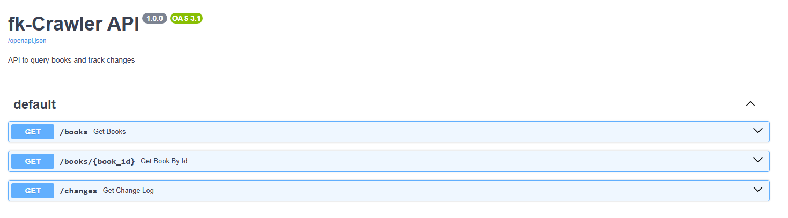
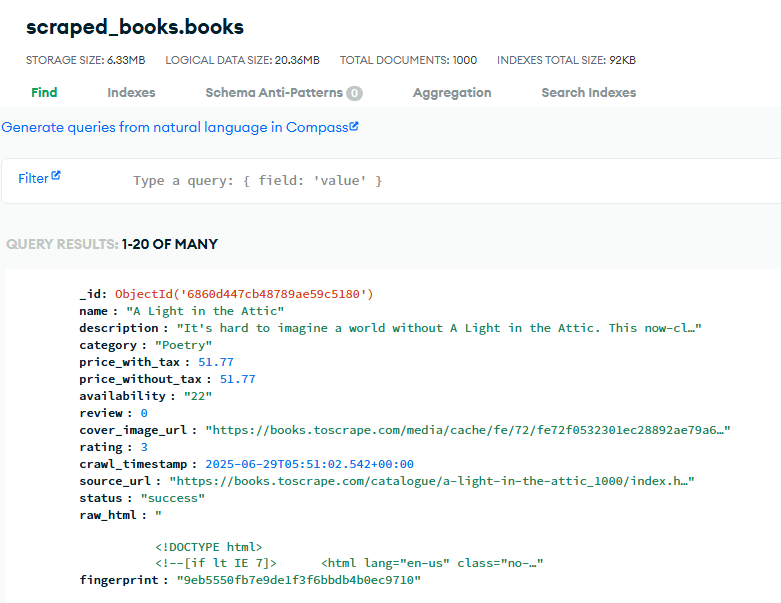
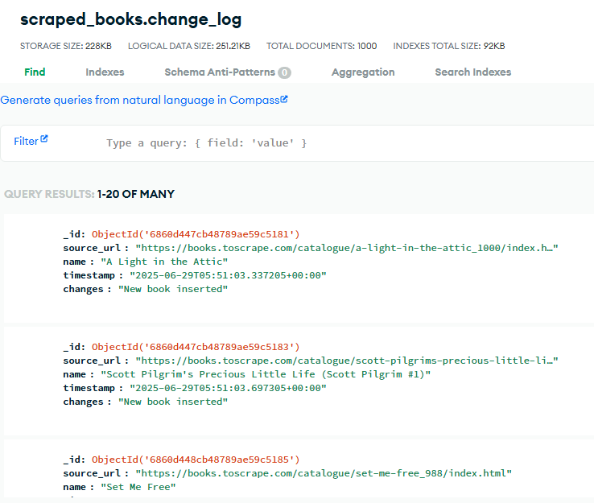
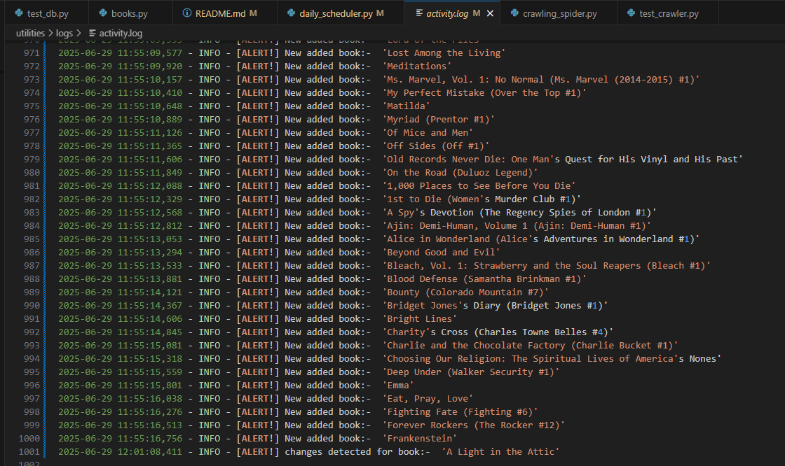
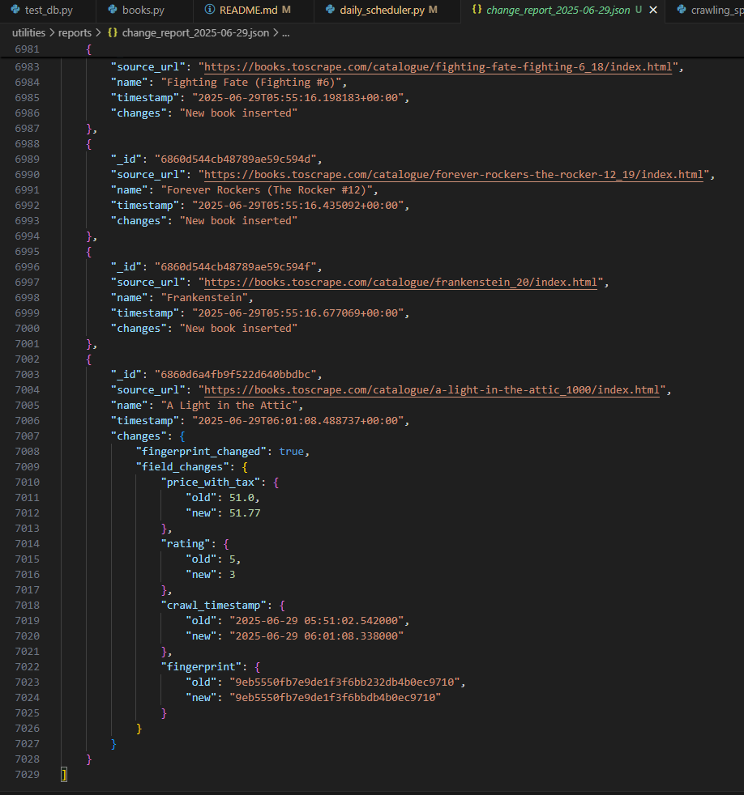
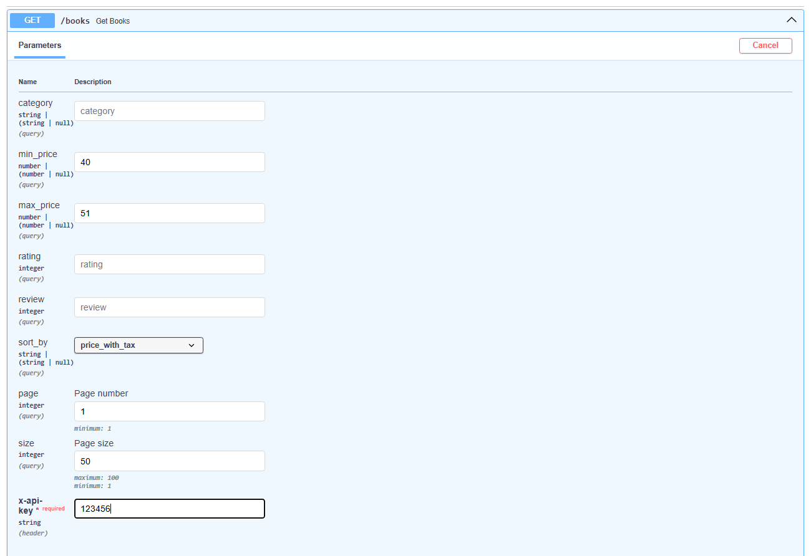
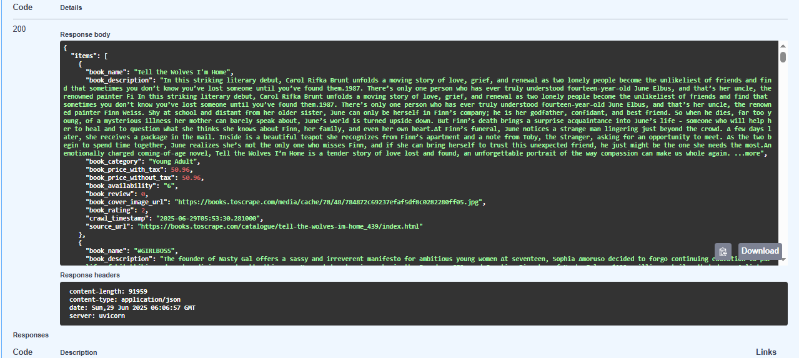
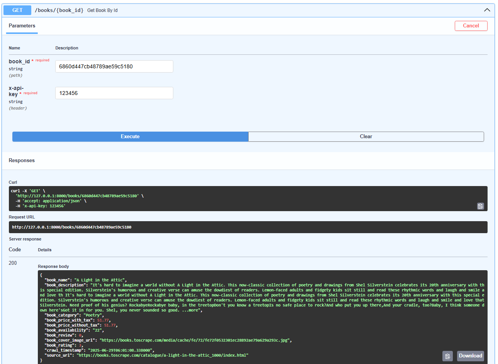
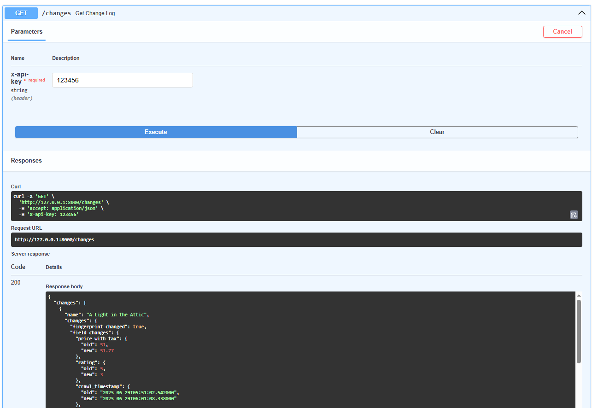

<div style="display: flex; justify-content: space-around; align-items: center;">
  
</div>

## 📚 fk-web-crawler: 

#### 📌 Summary 
Implemented a Web Crawler system using scrapy and stored the scraped data and change logs in MongoDB with features like Change Detection, Scheduler, Report generation and REST API Features using FastAPI

#### 🧠 Summary 
A fully-featured Python-based web crawler that:
- Crawls all pages and scrapes book data from `books.toscrape.com`
- Stores scraped book data including metadata and raw html snapshot to MongoDB Atlas
- Detects changes of existing books using fingerprinting strategy
- Logs changes and inserts to DB
- Able to resume from the last successful crawl 
- Schedules daily updates using APScheduler
- Serves data through a FastAPI-secured RESTful API with rate limiting and authentication

#### 🚀 Features
- ✅ Scrapy-powered web crawler
- ✅ MongoDB Atlas integration with deduplication
- ✅ Hash/Fingerprint-based change detection
- ✅ Change logging and raw HTML snapshot
- ✅ APScheduler-powered daily job
- ✅ Daily change reports in JSON
- ✅ RESTful FastAPI server using FastAPI:
  - `/books` with filtering, pagination, sorting
  - `/books/{book_id}` for book details
  - `/changes` to get recent logs
- ✅ API Key Authentication
- ✅ Rate limiting (100 req/hr per IP)
- ✅ OpenAPI (Swagger) docs

---

#### 📁 Project Structure

```
FK-CRAWLER/
│
├── api/                            # FastAPI server
│   ├── auth/                      
│   |   ├── security.py             # API-KEY Authentication
│   ├── models/                     # Pydantic models 
│   |   ├── book.py                 
│   |   ├── change.py               
│   |   ├── schemas.py              # Serialization for book and logs
│   │   │
│   ├── routes/                     # API endpoints
│   |   ├── __init__.py              
│   |   ├── books.py                 
│   |   ├── changes.py
│   ├── utils/                     # API endpoints
│   |   ├── rate_limiter.py
│   ├── __init__.py                  
│   ├── main_test.py                # For testing
│   └── main.py                     # main api file
│
├── crawler/                        # Web scraping logic
│   ├── fkcrawling/
│   |   ├── spiders/                # Scrapy spiders
│   |   |   ├── __init__.py         
│   |   |   ├── book_schema.py      # Pydantic model
│   |   |   ├── crawling_spider.py  # Web Crawler
│   |   |   └── mongodb_client.py   # MongoDB connection
│   |   ├── __init__.py             
│   |   ├── items.py                
│   |   ├── middlewares.py          
│   |   ├── pipelines.py            
│   └── ├── settings.py             # Scrapy config
│ 
├── scheduler/                      # Daily job scheduler
│   ├── daily_scheduler.py
│   └── crawler_runner.py
│
├── utilities/                      # Helper utilities
│   ├── logs/
│   |   ├── activity.log            # activity logging
│   ├── reports/
│   |   ├── report.json             # Generated Report
│   ├── assets/
│   |   ├── images/                 # images
│   ├── generate_report.py          # Daily changes report
│   └── log_config.py               # Log setup
│
├── tests/                          # Unit & integration 
│   ├── __init__.py   
│   ├── test_db.py   
│   └── test_crawler.py 
├── .env                            # Secure API_KEY and mongoDB URI
├── .gitignore
├── requirements.txt                # required packages
└── README.md                       # This file
```
---

## 🔧 Setup Instructions

### 📦 Requirements

- Python 3.10+
- VSCode
- MongoDB Atlas account


### 📁 1. Clone the Repository

```bash
git clone https://github.com/pointer2Alvee/fk-web-crawler.git
cd fk-crawler
```

### 📁 2. Install Dependencies

```bash
pip install -r requirements.txt
```

### ⚙️ 3. Create `.env` File

Create a `.env` file at the root:

```
MONGODB_URI= <mongodb+srv://<user>:<pass>@cluster.mongodb.net/>
API_KEY= <Set your own key>
```

> ✅ `.env` is automatically loaded using `dotenv`.

---

## 🕷️ Run Crawler

```bash
cd crawler/fkcrawling
scrapy crawl fkcrawler
```

- Inserts newly scraped books to MongoDB collection "books"
- Deduplication and Logs changes (if any) to MongoDB collection "change_log"
- Logs output to `/logs/activity.log`

---

## 🗓️ Run Scheduler - Runs Cralwer + Change Report Generator

In daily_scheduler.py :- 
hour=13,
minute=15
- Put hour and minute at the time you want to schedule the scheduler
- Here the scheduler will run daily at 13:15 or 1:15 PM


```bash
cd scheduler
python daily_scheduler.py
```

- Crawls every day using APScheduler
- Detects new books or changes
- Logs them in MongoDB and filesystem
- Generates Daily change Report in JSON

---

## 🧪 Run FastAPI Server

```bash
cd api
uvicorn main:app --reload
```

- API is hosted at `http://127.0.0.1:8000/`
- Swagger docs: `http://127.0.0.1:8000/docs`

---

## 🔐 API Key Usage

All endpoints are protected via API key.

### Headers:

```
FKCRAWLER-API-KEY: <Set your own key>
```

---

## 📂 API Endpoints

| Endpoint          | Method | Description                              |
|-------------------|--------|------------------------------------------|
| `/books`          | GET    | Get all books (filter, sort, paginate)   |
| `/books/{id}`     | GET    | Get book by MongoDB ObjectId             |
| `/changes`        | GET    | Get recent changes                       |
| `/docs`           | GET    | Swagger UI (OpenAPI spec)                |

---

## 📤 Daily Report Output

On successful run, you'll get:

```bash
/reports/
├── change_report_YYYY-MM-DD.json
```

Includes:
- New insertions
- Fields changed
- Source URLs and timestamps

---

## 🧪 Testing

Unit and integration tests will be added in `/tests/`.

Implemented with `pytest` for:
- DB operations
- Crawling output

Make sure you're in the root of the project and run:

```bash
pytest tests/
```

Demo Output summary :- 
```
===================== test session starts =================
collected 2 items

tests/test_crawler.py ....                          [66%]
tests/test_db.py .                                  [83%]
====================== 2 passed in 2.31s ==================

```

---


## Demonestration - 

### - mongoDB
---
<div style="display: flex; justify-content: space-around; align-items: center;">
  
</div>
<div style="display: flex; justify-content: space-around; align-items: center;">
  
   
</div>


### - log
<div style="display: flex; justify-content: space-around; align-items: center;">
  
</div>

### - report
<div style="display: flex; justify-content: space-around; align-items: center;">
  
</div>

### - fastapi
<div style="display: flex; justify-content: space-around; align-items: center;">
  
</div>

#### - fastapi - GET/Books
<div style="display: flex; justify-content: space-around; align-items: center;">
  
</div>
<div style="display: flex; justify-content: space-around; align-items: center;">
  
</div>

#### - fastapi - GET/{Book_id} & GET/{change_log}
<div style="display: flex; justify-content: space-around; align-items: center;">
  
</div>
<div style="display: flex; justify-content: space-around; align-items: center;">
  
</div>

## 💡 Sample MongoDB Document

**books Document Structure**
```json
{
  "_id": ObjectId("123..."),
  "name": "A Light in the Attic",
  "description" : "It's hard to..",
  "category" : "Poetry",
  "price_with_tax": 12.99,
  "price_with_out_tax": 12.99,
  "availability": "22",
  "review" : 0,
  "cover_image_url" : "https://books.toscrape.com/../fe72aea293c.jpg",
  "rating": 3,
  "crawl_timestamp": "2025-06-27T10:00:00Z",
  "source_url": "https://books.toscrape.com/catalogue/.../index.html",
  "raw_html": "<html>...</html>",
  "fingerprint": "abc123...",

}
```
**change_log Document Structure**

```json
{
  "_id": ObjectId("123..."),
  "source_url": "https://books.toscrape.com/catalogue/.../index.html",
  "name": "A Light in the Attic",
  "timestamp": "2025-06-27T10:00:00Z",
  "changes" : Object,
}
```
---

## 🧾 Deliverables Checklist (from PDF ✅)

| Requirement                               | Status     |
|------------------------------------------|------------|
| ✅ Crawler using Scrapy                  | Done       |
| ✅ Scheduler with change detection       | Done       |
| ✅ Change log storage                    | Done       |
| ✅ FastAPI server                        | Done       |
| ✅ API key + rate limiting               | Done       |
| ✅ Swagger UI                            | Done       |
| ✅ `.env` support                        | Done       |
| ✅ Daily reports (JSON + CSV)            | Done       |
| ✅ Screenshot/logs of scheduler/crawler  | ✔️ See `/logs` |
| ✅ Folder structure & README             | ✅ This file |

---

## 📬 Postman / Swagger UI

Use [http://localhost:8000/docs](http://localhost:8000/docs) to interactively test all endpoints.


---

## 🧠 Future Improvements

- Add unit + integration tests
- Dockerize for consistent environments
- Add email alerts for major changes
- Add export formats: CSV, PDF, Excel

---

## 🧑‍💻 Author

**Alvee**  
📧 pointer2alvee@gmail.com
🔗 [GitHub](https://github.com/pointer2Alvee)

---

### 🙏 Acknowledgements
- Open-source contributors and net
- Youtube videos :- 
  * [1](https://www.youtube.com/watch?v=mBoX_JCKZTE) 
  * [2](https://www.youtube.com/watch?v=GogxAQ2JP4A)
  * [3](https://www.youtube.com/watch?v=rvFsGRvj9jo)
---

## 📄 License
MIT License – feel free to use, improve, and contribute!
